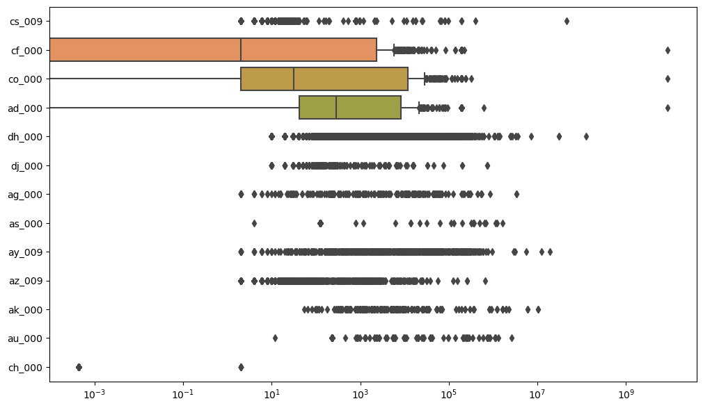

# Advanced Analytics with Tree-Based Methods: A Case Study on APS Failure Data

## Overview
This notebook, titled "Advanced Analytics with Tree-Based Methods: A Case Study on APS Failure Data," offers a comprehensive look at tree-based machine learning techniques, particularly focusing on the APS Failure dataset from Scania Trucks. A significant highlight of this notebook is the utilization of SMOTE (Synthetic Minority Over-sampling Technique) for addressing class imbalance, a common challenge in machine learning.

## Contents
1. <strong>Tree-Based Methods:</strong> Introduction to the focus and objectives of the notebook.
2. <strong>Download APS Failure Data:</strong> Guidance on accessing and understanding the APS Failure dataset.
3. <strong>Data Preparation:</strong> Detailed steps for data cleaning and preparation, with an emphasis on handling missing values.
4. <strong>Techniques for Missing Values:</strong> Exploration and application of methods to manage missing data.
5. <strong>Coefficient of Variation Analysis:</strong> Calculation and analysis of feature variability.
6. <strong>Correlation Matrix Visualization:</strong> Techniques for creating and interpreting correlation matrices for feature analysis.
7. <strong>Feature Visualization:</strong> Generation of scatter and box plots for key features, assessing their significance.
   
8. <strong>Class Imbalance Analysis:</strong> Examination of the dataset's balance, highlighting the importance of addressing class imbalance.
9. <strong>Random Forest Training:</strong> Methodology for training and evaluating a Random Forest model, including performance metrics.
    - Training Accuracy Score is: 0.992
    - Testing Accuracy Score is: 0.9879
    - |    | Training OOB Error	 | Testing Error  |
      |----| ------------------- | -------------- |
      | 0  | 0.0094              | 0.01213        |

10. <strong>Addressing Class Imbalance in Random Forest:</strong> Introduction and application of methods to counter class imbalance, with a focus on SMOTE.
11. <strong>XGBoost and Model Trees:</strong> Detailed exploration of model trees using XGBoost, inclusive of regularization and cross-validation techniques.

    - Training Accuracy Score is: 0.9982
    - Testing Accuracy Score is: 0.9909
13. <strong>SMOTE Application in XGBoost:</strong> Comprehensive use of SMOTE for class imbalance correction in XGBoost models, demonstrating its impact on model performance.
    
    - |        | Before SMOTE	 | After SMOTE  |
      |--------| ------------- | ------------ |
      | class  |               |              |
      | 0      | 59000         | 59000        |
      | 1      | 1000          | 59000        |
    - Training Accuracy Score is: 0.9982
    - Testing Accuracy Score is: 0.9915

## Setup Instructions
1. <strong>Environment Setup:</strong> Ensure installation of Python 3.x with essential libraries like pandas, numpy, scikit-learn, xgboost, and matplotlib.
2. <strong>Dataset Download:</strong> https://archive.ics.uci.edu/ml/datasets/APS+Failure+at+Scania+Trucks

